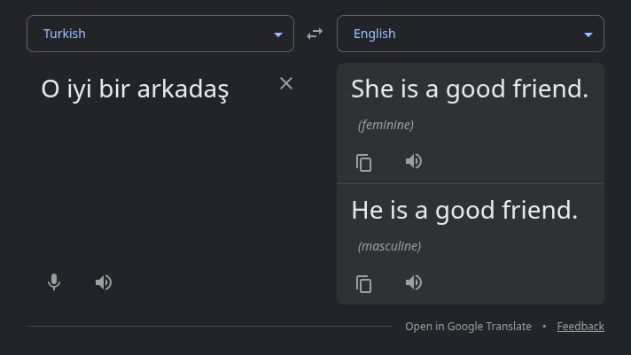

### When a 2nd hand car in India was more expensive than a new one
One of my favorite long form podcasts is [The Seen And The Unseen](https://seenunseen.in/) by [Amit Varma](https://amitvarma.com/). The guy is a certified yapper! Anyway, it was in this episode with Rahul Ahluwalia that he mentions this mind-boggling fact, and I knew I *had* to know more.

Remember [License Raj](https://en.wikipedia.org/wiki/Licence_Raj), the draconian pre-1991 era when the government controlled all means of production? The policies that led to this absurd situation were pretty common at this time, and one such masterstroke was the [IRDA act, 1951](https://indiankanoon.org/doc/800551/), where vehicle manufacturers were assigned rigit manufacturing quotas and were **legally prohibited** from expanding capacity. Imagine being an ambitious factory owner *knowing* that you can churn out more, but the govt. won't let you, as it fears the concentration of wealth in private hands, and doesn't want you to squander scarce national resources.

Well, all this naturally led to an extreme gap in demand and supply, which in turn created mult-year waiting lists and drove the black market demand for a second hand vehicle significantly higher than the state controlled showroom price of one. Delivery backlogs by the 1970s and 1980s had gotten to a point where families were booking Bajaj Scooters at the time of their child's birth, in hopes that the vehicle could be delivered in time for their wedding.

*I now have a burning desire to know whether my grandfather made such a booking when my father was born in '71*

### Turkish: A language with no concept of genders
I came across this while learning German using the [Language Transfer app](https://play.google.com/store/apps/details?id=org.languagetransfer&hl=en_IN) (if you use Duolingo, my condolences). Lesson 24 was about genders I was gobsmacked when the narrator mentioned this. Turns out, there is *some* nuance.

Before we see what's going on though, would you have a look at this! Bonkers!

Also, never really knew that google translate could do multiple translations. In my language learning journey, I've also observed that it is extremely good at reconizing language nuances. Bravo!

The [history](https://en.wikipedia.org/wiki/Turkic_languages) of it doesn't really interest me, but I did come across another mind bender while researching this. Genderless pronouns are not only not uncommon, they are actually the global majority![^1]

I only wanted to know what something like this means for native speakers. Apparently, native speakers are able to make everyday communication work because they identify <abbr title="who/what is being talked about">referents</abbr> through context, names, and noun phrases. Also, the language not having gendered pronouns doesn't mean that gender cannot be expressed at all. Turkish speakers use explicit gender words when it matters. For eg. _kadın doktor_ (female doctor) or _erkek doktor_ (male doctor).

The ambiguity becomes more troublesome in *translation* than in Turkish conversation. A language like English may require a choice among *he*, *she*, or *it*, but the source language may not be able to supply it, leaving translators to infer from wider context. Machine translation illustrates the risk, as shown in [this 2021 study](https://aclanthology.org/2021.inlg-1.7/), which found that systems translating neutral Turkish into English have sometimes selected _he_ or _she_ according to occupational stereotypes rather than evidence in the sentence.

[^1]: According to data surveyed in the World Atlas of Language Structures (WALS), roughly 55% to 58% of the world's languages make no gender distinctions in their independent personal pronouns. More information [here](https://wals.info/chapter/44)